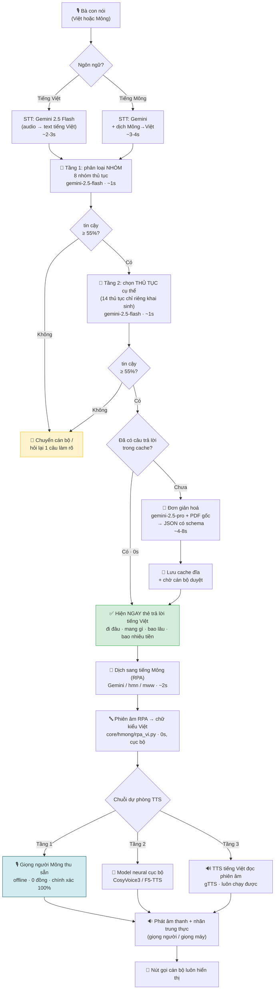
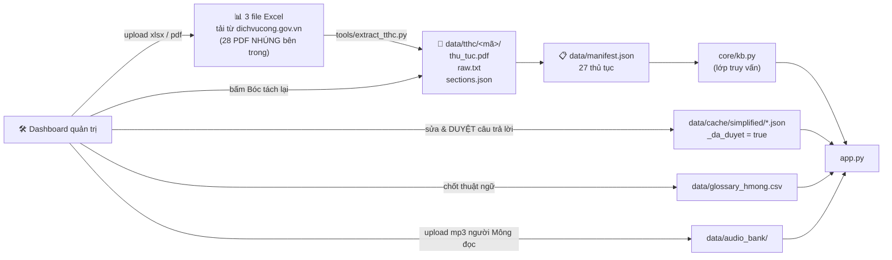

# Sơ đồ luồng dữ liệu — LUẬT GẦN BẢN v2

## 1. Luồng chính (lúc bà con dùng app)

**Điểm then chốt về độ trễ:** ô `J` (thẻ trả lời tiếng Việt) được render **trước
khi** chạy bước dịch và TTS. Bà con đã có câu trả lời đọc được ở giây thứ 5-8,
trong lúc giọng Mông vẫn đang tạo. Đây là khác biệt lớn nhất so với bản v1 —
v1 bọc cả 4 lời gọi API trong **một** `st.spinner`, nên người dùng nhìn màn hình
trắng suốt 15-20 giây và tưởng app treo.

## 2. Luồng dữ liệu (lúc cán bộ cập nhật)

## 3. Ngân sách độ trễ thực tế

| Bước | Lần đầu | Lần 2 (có cache) |
|---|---|---|
| STT tiếng Việt | 2–3 s | — |
| Phân loại nhóm | 0,8–1,5 s | 0 s |
| Chọn thủ tục | 0,8–1,5 s | 0 s |
| Đơn giản hoá (Pro + 9k ký tự) | 4–8 s | **0 s** |
| Dịch sang Mông | 1,5–3 s | 0 s |
| TTS | 1–2 s (gTTS) / 10–20 s (neural) | 0 s |
| **Tổng** | **11–19 s** | **2–3 s** |

Vì vậy phải **làm nóng cache trước buổi demo**: Dashboard → tab *Kho thủ tục* →
nút *🔥 Tạo sẵn câu trả lời*. Sau bước đó, mọi thủ tục trả lời trong 2-3 giây và
app chạy được cả khi wifi hội trường chập chờn.
